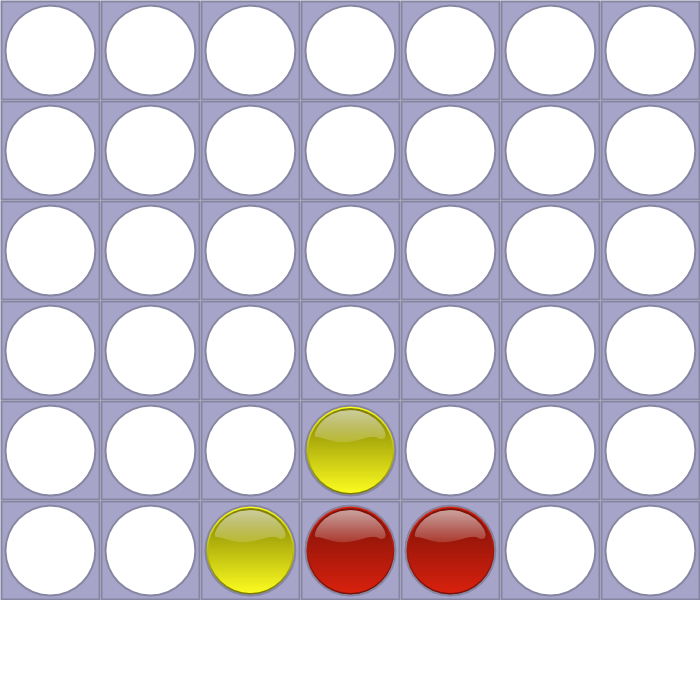

A connect 4 solver coded in python.

This solver can solve connect 4 positions and give out negative and positive evaluation. Positive evaluation means that
who ever is playing first will win with perfect play. Negative evaluation means a forced lost with perfect play.

The sequence of moves played so far are represented with a string of digits.
For example "4453" is the position below where player 1 is red and player 2 is yellow:

